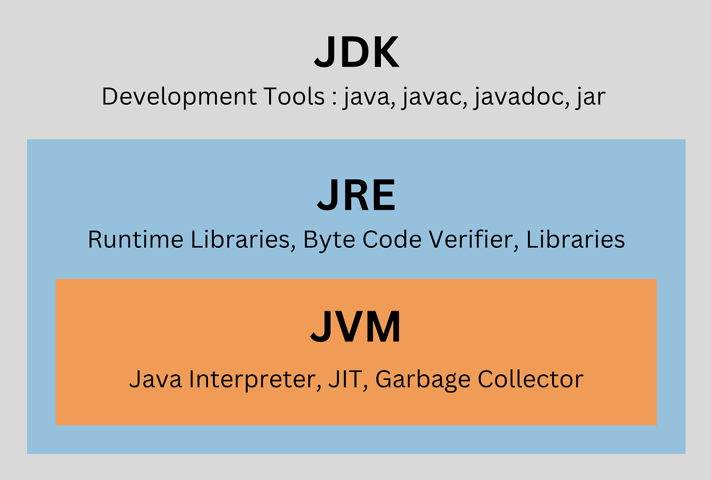
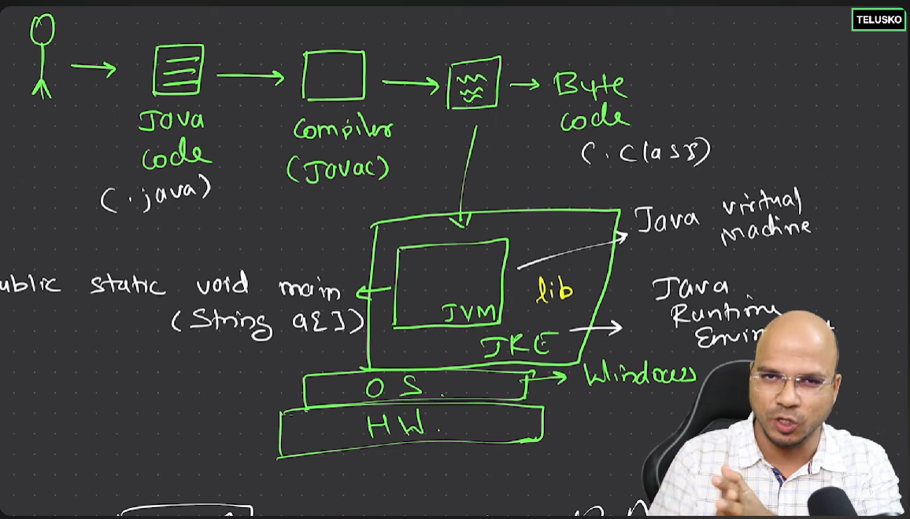

- First we have to install JDK (prefer LTS Version)
- set variable path
- now check java version from command prompt (java --version)
- chech javac version (javac --version)

- java for run the application 
- javac for compile the application

-------
- Java is platefrom independent but JVM is not
- JVM understand byte code

   

